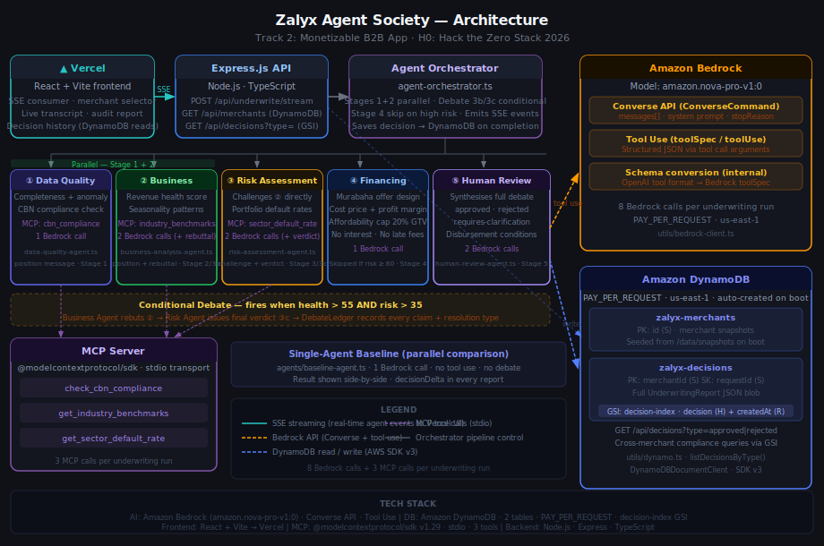

# Zalyx Agent Society

**Multi-Agent Merchant Underwriting System** — H0: Hack the Zero Stack · Track 2: Monetizable B2B App

A five-agent debate pipeline that makes smarter, more transparent merchant financing decisions than any single AI call. Built on real anonymized data from Zalyx booking keeping platform (mobile app).

**Stack:** Amazon Bedrock (Nova Pro) · Amazon DynamoDB · Vercel · MCP

**Live demo:** [zalyx-agent-society-aws.vercel.app](https://zalyx-agent-society-aws.vercel.app)
**API:** [zalyx-underwriting-env.eba-jp6apm5g.us-east-1.elasticbeanstalk.com](http://zalyx-underwriting-env.eba-jp6apm5g.us-east-1.elasticbeanstalk.com)

[](./LICENSE)
[](https://aws.amazon.com/bedrock/)
[](https://aws.amazon.com/dynamodb/)

---

## What it does

Five specialized AI agents (powered by **Amazon Bedrock**) debate every financing application, each enriched with live data from a custom **MCP (Model Context Protocol) server**. Every agent uses Bedrock tool use to return structured JSON — not parsed prose. All merchant snapshots and underwriting decisions are persisted in **Amazon DynamoDB**, giving a full auditable history of every decision the system has made.

| Agent | Role | MCP Tool Used |
|---|---|---|
| 🔍 Data Quality | Validates completeness, flags anomalies | `check_cbn_compliance` |
| 📈 Business Analysis | Assesses revenue trajectory, health score | `get_industry_benchmarks` |
| ⚠️ Risk Assessment | **Challenges** the Business Agent's assumptions | `get_sector_default_rate` |
| 🔄 Debate Round | Business Agent **rebuts**; Risk Agent issues **final verdict** | — |
| 💰 Financing Structure | Designs Murabaha-compliant terms from GTV | — |
| 👤 Human Review | Synthesises the full debate → final decision | — |

A **single-agent baseline** runs in parallel — same data, one LLM call — to demonstrate measurable improvement from the multi-agent approach.

---

## Key design decisions

**Murabaha financing (Islamic finance compliant)**
Zalyx does not lend money. It purchases assets on the merchant's behalf at a disclosed cost price, then sells those assets to the merchant at a fixed sale price. The difference is Zalyx's profit margin — no interest, no compounding, no late fees.

```
Sale price  = % of merchant's avg monthly GTV (risk-tiered)
Cost price  = sale price × (1 − profit margin)
Installment = sale price ÷ tenor months
```

| Risk tier | GTV offer | Tenor | Profit margin |
|---|---|---|---|
| Low (0–35) | 25% of avg monthly GTV | 6 months | 10% |
| Moderate (35–65) | 15% of avg monthly GTV | 3 months | 15% |
| High (65–80) | 5% of avg monthly GTV | 2 months | 20% |
| Very high (80+) | Rejected | — | — |

Affordability cap: monthly installment must be ≤ 20% of avg monthly GTV.

**Conditional debate round**
The debate round only fires when the Business Analyst's health score > 55 AND the Risk Officer's score > 35 — i.e. when agents genuinely disagree. Clear approvals and rejections skip it, saving Bedrock calls.

**All 5 agents use Bedrock tool use**
Every agent submits its output via a Bedrock tool call (`toolSpec` / `toolUse`) rather than prose. Every field in the final report comes from a structured JSON argument, not string parsing.

**MCP integration**
A dedicated MCP server (stdio transport, `@modelcontextprotocol/sdk`) exposes three tools that agents call during reasoning — live lookups that change what the agents say:

- `check_cbn_compliance` — blocks applications from CBN watchlist or restricted sectors
- `get_industry_benchmarks` — sector-specific GTV averages, active day norms, completion rate benchmarks
- `get_sector_default_rate` — historical default rates for this sector + risk tier, and suggested Murabaha profit margin floor

**DynamoDB data model**
Two tables, provisioned automatically on first run (PAY_PER_REQUEST billing):

- `zalyx-merchants` — partition key `id` — merchant snapshots seeded from `data/snapshots/`
- `zalyx-decisions` — partition key `merchantId`, sort key `requestId` — full `UnderwritingReport` blobs, newest first

**DebateLedger**
When the debate round fires, a deterministic `DebateModerator` parses the transcript into typed `DebateClaim[]` objects — each with a `claimId`, evidence from both sides, and a resolution type. Machine-readable and auditable, not just a chat log.

---

## Architecture

```
Browser (React + Vite → deployed on Vercel)
  │
  │  SSE stream: POST /api/underwrite/stream
  │  Parallel:   POST /api/baseline
  ▼
Express API (Node.js / TypeScript)
  │
  ├─ Amazon DynamoDB
  │    ├── zalyx-merchants  (GET /api/merchants, GET /api/merchants/:id)
  │    └── zalyx-decisions  (persisted after every underwriting run)
  │
  ▼
Agent Orchestrator
  │
  ├─ Stage 1+2 (parallel):
  │    ├── Data Quality Agent  ──────── MCP: check_cbn_compliance
  │    └── Business Analysis Agent ──── MCP: get_industry_benchmarks
  │
  ├─ Stage 3:
  │    └── Risk Assessment Agent ─────── MCP: get_sector_default_rate
  │
  ├─ Stage 3b/3c (conditional — only when agents disagree):
  │    ├── Business Analysis Agent (rebuttal)
  │    └── Risk Assessment Agent (final verdict)
  │         └── DebateModerator → DebateLedger (typed claims, deterministic)
  │
  ├─ Stage 4 (skipped if very high risk):
  │    └── Financing Structure Agent (Murabaha engine)
  │
  └─ Stage 5:
       └── Human Review Agent → Decision + DecisionDelta + RunObservability
  │
  ├── Amazon Bedrock (Nova Pro / Claude, tool use — all 5 agents)
  └── MCP Server (stdio) ← mcp-server/index.ts
        ├── check_cbn_compliance
        ├── get_industry_benchmarks
        └── get_sector_default_rate
```



---

## Quickstart (local)

### Prerequisites

- Node.js 20+
- AWS account with Bedrock model access enabled ([request here](https://console.aws.amazon.com/bedrock/home#/modelaccess))
- DynamoDB access in your AWS region

### 1. Clone and install

```bash
git clone https://github.com/alateefah/zalyx-agent-society-aws.git
cd zalyx-agent-society
yarn install
cd frontend && yarn install && cd ..
```

### 2. Configure environment

```bash
cp .env.example .env
```

Edit `.env`:

```env
AWS_ACCESS_KEY_ID=your_access_key
AWS_SECRET_ACCESS_KEY=your_secret_key
AWS_REGION=us-east-1
BEDROCK_MODEL_ID=amazon.nova-pro-v1:0
PORT=3001
```

> **No AWS credentials?** Set `BEDROCK_MOCK_MODE=true` — all five agents return realistic demo responses and DynamoDB falls back to local JSON files. A pulsing **"Mock mode"** badge shows in the UI.

### 3. Run

```bash
yarn dev
```

- Backend API: http://localhost:3001
- Frontend UI: http://localhost:5173

DynamoDB tables are created automatically on first boot and seeded with five demo snapshots: four benchmark merchants and one custom video fixture.

---

## Demo merchants

Four real anonymized Zalyx merchants with different risk profiles:

| ID | Business | Outcome | Notes |
|---|---|---|---|
| ZALYX-004 | Lagos Kitchen Co. (F&B) | **Approved** | Strong multi-month revenue trend, Tier A |
| ZALYX-001 | Bright Future Academy (School) | **Approved with conditions** | Debate round contextualises term-fee seasonality |
| ZALYX-002 | GlowUp Beauty (Skincare) | **Requires clarification** | 72% revenue decline and 2 active days fall below the sector floor |
| ZALYX-003 | Apex Creative Services (Freelancer) | **Rejected** | Single-month concentration, zero recent activity, 75% receivables uncollected |

### Benchmark Results (`benchmark/results.md`)

| Metric | Value |
|---|---|
| Merchants benchmarked | 4 |
| Decisions that differed (baseline vs multi-agent) | **3/4** |
| Debate round fired | **2/4** merchants |
| Structured risk factors surfaced | 16 |
| Avg structured output completeness | **100%** |
| Avg actionability score | **100/100** |
| Avg baseline latency | 0.5s |
| Avg multi-agent latency | 5.6s |
| Bedrock tool calls per run | 5–8 (varies by debate and stage skipping) |
| MCP calls per run | 3 (CBN + benchmarks + default rate) |

Run: `yarn benchmark`

---

## API Reference

### `GET /api/merchants`
List all merchants from DynamoDB.

### `GET /api/merchants/:id`
Load a specific merchant snapshot.

### `POST /api/underwrite/stream`
Run the full 5-agent debate with **live SSE streaming**. Persists the completed report to DynamoDB.

**Body:** `ZalyxMerchantSnapshot`
**Response:** `text/event-stream` — `AgentProgressEvent` objects as agents complete, then a final `UnderwritingReport`.

### `POST /api/baseline`
Run the single-agent baseline (for comparison).

### `GET /api/merchants/:merchantId/decisions`
Retrieve lightweight decision summaries for a merchant from DynamoDB, newest first.

### `GET /api/merchants/:merchantId/decisions/:requestId`
Retrieve one complete underwriting report with an O(1) DynamoDB composite-key lookup.

### `GET /api/health`
```json
{
  "status": "ok",
  "ai": { "provider": "Amazon Bedrock", "model": "amazon.nova-pro-v1:0", "mockMode": false },
  "database": { "provider": "Amazon DynamoDB", "region": "us-east-1", "mockMode": false }
}
```

---

## Amazon Bedrock integration

All five agents use `chatWithTools()` with Bedrock's Converse API (`ConverseCommand`). The client converts OpenAI-format tool definitions to Bedrock `toolSpec` format internally, so agent code is provider-agnostic:

```typescript
// bedrock-client.ts converts tool schema format automatically
const response = await bedrockClient.chatWithTools(
  messages,
  [SUBMIT_RISK_VERDICT_TOOL],
  "Risk Assessment Agent"
);
// → toolCall: { name: "submit_risk_verdict", arguments: { risk_level, adjusted_risk_score, ... } }
```

Under the hood, Bedrock Converse returns:
```typescript
response.output.message.content  // ContentBlock[]
// stopReason === "tool_use" → toolUse.name + toolUse.input (already-parsed JSON, no string parsing needed)
```

Switch models by changing `BEDROCK_MODEL_ID` — any model with tool use support works.

---

## Amazon DynamoDB integration

```typescript
import { getMerchantSnapshot, saveUnderwritingDecision, listMerchants } from "./utils/dynamo";

// Read merchant from DynamoDB (falls back to local JSON in mock mode)
const snapshot = await getMerchantSnapshot("ZALYX-001");

// Persist decision after every underwriting run (called automatically by server.ts)
await saveUnderwritingDecision(report);

// List all merchants
const all = await listMerchants();
```

Tables use `PAY_PER_REQUEST` billing — no capacity planning, scales to zero, scales to millions.

---

## Technical stack

| Layer | Technology |
|---|---|
| AI | Amazon Bedrock (Nova Pro), Converse API, tool use |
| Database | Amazon DynamoDB (PAY_PER_REQUEST, two tables) |
| MCP | `@modelcontextprotocol/sdk` v1.29, stdio, 3 tools |
| Backend | Node.js, Express, TypeScript |
| Frontend | React, Vite → deployed on Vercel |
| Infrastructure | Docker, Vercel (frontend), AWS (backend) |

---

## Tests

```bash
yarn test
```

- `tests/murabaha.test.ts` — 25 unit tests: risk tier selection, GTV pricing, affordability cap, installment math
- `tests/orchestrator.test.ts` — 7 integration tests: pipeline completes, debate fires/skips, Stage 4 skip

32/32 passing.

---

## Docker

```bash
docker compose up --build
```

---

## Deploy

### Backend — AWS ECS / EC2

```bash
# EC2 (Ubuntu 22.04) with IAM role granting Bedrock + DynamoDB access:
curl -fsSL https://get.docker.com | sh
git clone https://github.com/alateefah/zalyx-agent-society-aws.git
cd zalyx-agent-society
echo "AWS_REGION=us-east-1" > .env
echo "BEDROCK_MODEL_ID=amazon.nova-pro-v1:0" >> .env
docker compose up -d --build
curl http://localhost:3001/api/health
```

### Frontend — Vercel

```bash
cd frontend
npx vercel --prod
# Add VITE_API_URL=https://your-backend-url in Vercel environment settings
```

---

## Hackathon

**Event:** H0: Hack the Zero Stack with Vercel v0 and AWS Databases
**Track:** Track 2 — Monetizable B2B App
**Deadline:** Jun 29, 2026 @ 5:00pm PDT
**Devpost:** https://h01.devpost.com
**Stack:** Amazon Bedrock · Amazon DynamoDB · Vercel

---

## License

MIT — see [LICENSE](./LICENSE)
